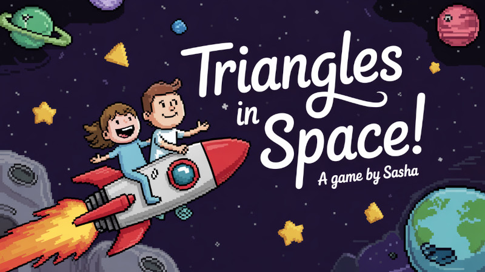
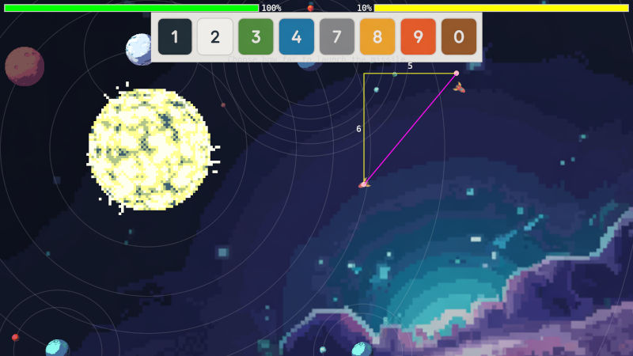

# Triangles in Space!




A 2D multiplayer space combat arena game built with Python and Pygame where in order to win it helps to know your right triangles and square roots.

## Description



**"Triangles in Space!"** is a little two-player-over-single-keyboard game where two rockets battle each other to the DEATH: 

Control keys: 
* player 1 (WASD for movement, Q to shoot);
* player 2 (NumPad arrows for movement, NumPad's 7 to shoot).

In order to shoot one has to charge their mana to 100% by bouncing off the planets and their moons: the harder is bouncing, the higher is the mana charge up.

The shot only works if the players are right distance from each other: not to far, not to close.

When the shot is activated, the world freezes, and the player is asked to choose the distance the missile will fly in the direction of the enemy rocket before it explodes.

The player is given the lengths of the right triangle's sides to help them make a good call.


## Why?

**"Triangles in Space!"** is very much a **non-educational** game. It's classic brainrot and poorly coded mayhem we are all weirdly attracted too. It's great.

Still,  having some understanding of the right triangles, or being able to casually eyeball approximate square roots in your head, makes you better at this game. Just like in real life, mathy things sometimes comes up.

Why? Education is when adults treat kids' minds the same way they treat all those boxes they have in their garages: fill 'em with random junk in case "they need it someday".

Kids are not boxes, they are people. People are great at solving problems and figuring poop out. All it takes is to show that the problem is worth solving and step aside.


## Installation


Ensure you have Python 3.8 or newer installed.

1.  **Clone the repository (if applicable):**
    ```bash
    git clone <your-repository-url>
    cd stupid-space-game
    ```

2.  **Create and activate a virtual environment (Recommended):**
    ```bash
    python3 -m venv .venv
    source .venv/bin/activate
    # On Windows use: .venv\Scripts\activate
    ```
    
4.  **Install the game and its dependencies:**
    Using `pip` with the current directory (`.`) will install the package based on `pyproject.toml` in editable mode (`-e`) or standard mode.
    ```bash
    # For development (allows code changes without reinstalling):
    pip install -e .

    # For a standard installation:
    pip install .
    ```
    This command reads the `pyproject.toml`, uses `hatchling` to build the package if necessary, and installs it along with the specified `dependencies` (pygame).

## Usage

Once installed, you can run the game using the script defined in `pyproject.toml`:

```bash
./triangles-in-space